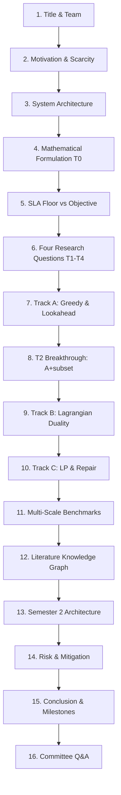

# Milestone M1 Capstone Proposal Presentation: Slide Deck & Defense Script

**Project Title:** Profile-Guided Multi-Workflow Resource Orchestration Platform  
**Milestone:** M1 (Proposal Presentation) — **30 September 2026**  
**Team Members:** Roles 035, 075, 077, 083, 089  
**Advisor:** Prof. Tossaphol  
**Presentation Target:** 20 minutes presentation + 10 minutes committee Q&A  

---

## Slide-by-Slide Outline & Visual Specifications

---

### Slide 1: Title & Project Identity
- **Visuals:** Project title, university header, team members with assigned roles (035 Heuristics, 075 Mathematical Programming, 077 Systems & Profiling, 083 Software Architecture, 089 Empirical Methodology), and advisor name.
- **Key Message:** We present a mathematically grounded, profile-guided orchestration platform that jointly solves model selection and hardware instance provisioning under hard GPU budgets across concurrent workflow DAGs.
- **Speaker Script (035 / Lead):**
  > "Good afternoon, Prof. Tossaphol and members of the examination committee. Today, our team presents our Senior Capstone proposal: the Profile-Guided Multi-Workflow Resource Orchestration Platform. Over the past month, we did not simply draft an abstract proposal—we designed, mathematically formulated, implemented, and benchmarked a complete Proof-of-Concept with 562 automated tests to answer four foundational research questions before building the full system. Today, we share those findings and our Semester 2 implementation architecture."

---

### Slide 2: The Enterprise Cloud Dilemma — LLM Resource Scarcity
- **Visuals:** Diagram showing multiple enterprise departments submitting complex LLM agent workflows (RAG, code synthesis, document triage) against a fixed cluster GPU budget. Highlight the tension between model heterogeneity (small 7B models vs. 70B models) and discrete instance provisioning.
- **Key Message:** Enterprise AI clusters face extreme GPU scarcity. Independent per-workflow routing leads to fragmentation, idle headroom, and budget collapse.
- **Speaker Script (077):**
  > "Enterprise software is rapidly transitioning from single model calls to multi-stage agentic workflows—complex DAGs of specialized tasks. In enterprise private clouds, GPUs are expensive, scarce, and finite. Today, workflow orchestrators treat model selection and hardware provisioning as disconnected problems. If workflow A buys an 8-GPU instance to run a single task, that hardware often sits 70% idle. If three workflows share a cluster, uncoordinated decisions exhaust the GPU budget early, stranding critical business tasks. To achieve cost efficiency without violating SLAs, an orchestrator must look across the entire batch of workflows and solve routing and instance provisioning jointly."

---

### Slide 3: System Overview — Decoupling Logical Pipelines from Physical Execution
- **Visuals:** Architecture flow from submitted DAGs $\to$ SLA candidate filtering $\to$ Offline Allocation Engine (Heuristic / LP / Dual) $\to$ Dynamic Provisioning Engine $\to$ Runtime Profiling & Telemetry Loop.
- **Key Message:** Adopt a clean two-level decoupling: workflows specify logical tasks and SLA constraints; the orchestration platform decides physical routing and provisioning.
- **Speaker Script (083):**
  > "Our architecture establishes a clean separation of concerns. Developers write declarative workflows specifying task requirements—throughput demand, latency ceilings, and reliability floors. Our platform takes this entire batch offline and performs joint optimization: Level 1 decides which model profile serves each task; Level 2 determines exactly how many physical instances of each profile to provision. Real-time telemetry profiles latency and empirical reliability, closing the loop to adapt future allocations."

---

### Slide 4: Formal Problem Formulation ($T_0$)
- **Visuals:** The mathematical programming formulation:
  $$\min \sum_{m \in M} n[m] \cdot \text{price}(m)$$
  subject to (C1) unit assignment, (C2) aggregate throughput coverage, and (C3) global GPU budget constraint $\sum n[m] \cdot \text{gpu}(m) \le B$.
- **Key Message:** The problem is formally classified as a *Modular Capacitated Facility Location Problem with a Budget Constraint (MCFLP-B)*.
- **Speaker Script (075):**
  > "Every algorithm in our platform is derived from a rigorous mathematical formulation, not ad-hoc heuristics. We formulate resource orchestration as a Modular Capacitated Facility Location Problem with a global budget constraint. Model profiles are facilities, provisioned instances $n[m]$ are modular units opened, and workflow tasks are customers. Constraint C1 guarantees every task is assigned. Constraint C2 couples tasks together: aggregate routed load cannot exceed provisioned throughput. Constraint C3 caps total GPUs. Because instance costs are step-functions, a task's marginal cost depends on whether its chosen profile already has headroom—which depends on assignments not yet made. This coupling is the central mathematical difficulty."

---

### Slide 5: Architectural Rationale — Hard SLA Floor vs. Multi-Objective Optimization
- **Visuals:** Side-by-side comparison table of Option A (Hard SLA Floor $R_{\min}$) versus Option B (Multi-Objective weighted cost-reliability).
- **Key Message:** Reliability is enforced as an SLA feasibility floor ($C(t)$), preserving single-objective tractability and avoiding arbitrary dollar-to-reliability trade-off hyperparameters.
- **Speaker Script (083):**
  > "A vital architectural question we resolved ahead of milestone T0 is: should reliability be an objective term or a constraint? In enterprise cloud environments, reliability is a contract: an SLA requires 99.5% success. Achieving 99.9% provides diminishing value, but dropping to 99.0% breaches contract. Treating reliability as a multi-objective term would require an arbitrary weighting factor $\gamma$ to trade off dollars against reliability percentages, blurring guarantees. By filtering candidate profiles $C(t)$ by SLA floors prior to optimization, we guarantee feasibility by construction, maintain an exact single-objective facility location problem, and compute provable dual bounds."

---

### Slide 6: The Proof-of-Concept Mandate — Answering $T_1$ through $T_4$
- **Visuals:** Table summarizing the four foundational research questions:
  - $T_1$: Lagrangian relaxation axis and dual bound quality.
  - $T_2$: Defeating aggregate coupling in greedy construction.
  - $T_3$: Defining the budget phase transition.
  - $T_4$: Track trade-offs across solution quality and runtime.
- **Key Message:** The September PoC existed to test load-bearing assumptions before committing to full-scale Semester 2 implementation.
- **Speaker Script (089):**
  > "Rather than spending months building an unvalidated system, our September Validation Plan defined four explicit research questions, T1 through T4. If greedy could not handle aggregate coupling, or if Lagrangian relaxation offered no bound advantage over linear programming, we needed to know now. Over the past four weeks, we implemented all 10 planned build steps, built a matched-condition testing harness, and executed rigorous empirical benchmarks."

---

### Slide 7: Track A — Greedy Construction & Feasibility Lookahead
- **Visuals:** Trace of plain greedy failure on the verified fixture (`adversarial_3t2p`) where greedy returns cost 300 vs optimum 280. Diagram of Cheng & Nguyen's M1 feasibility lookahead preventing GPU starvation.
- **Key Message:** Plain greedy fails under aggregate coupling; feasibility lookahead (`A+M1`) eliminates budget starvation but cannot overcome coupled task placement.
- **Speaker Script (035):**
  > "In Track A, plain greedy assigns tasks one by one based on lowest marginal cost. On our hand-verified fixture, plain greedy gets trapped at cost 300 against the optimum of 280 because tasks t1 and t2 appear cheaper individually on m1, but together they fit on m2 for less total cost. Furthermore, plain greedy is blind to GPU consumption: it buys cheap, GPU-hungry profiles early and runs out of budget, stranding later tasks. To address this, we adapted Cheng & Nguyen's feasibility lookahead: before committing an assignment, the algorithm checks that all remaining unassigned tasks still have at least one admissible profile. This eliminated 93% of feasibility failures at zero runtime cost."

---

### Slide 8: $T_2$ Algorithmic Breakthrough — Subset Consolidation (`A+subset`)
- **Visuals:** Diagram showing joint subset relocation: tasks $t_1$ and $t_2$ moving together to profile $m_2$ while $t_3$ stays on $m_1$. Benchmark chart showing mean gap dropping from 32.37% to 1.57% on structured instances. **Plot the two means; do not label the chart with a fold-change.**
- **Key Message:** Exploring a 2-subset relocation neighborhood breaks the aggregate-coupling trap, achieving the exact global optimum of 280 on the adversarial fixture and slashing heuristic error by 20×.
- **Speaker Script (035):**
  > "Lookahead solved feasibility, but not aggregate coupling. Why? Because improving the fixture requires moving two tasks together. Single-task moves worsen cost locally, and moving all tasks is blocked because task t3 is ineligible for m2. We designed a multi-move subset consolidation neighborhood, evaluate moves of subsets of size $k \le 2$. On our adversarial fixture, subset consolidation immediately discovers the joint move of t1 and t2 to m2, achieving the exact global optimum of 280. When we evaluated it across both generators on 72 matched instances, subset consolidation was never worse than plain greedy - not on a single instance. It was strictly better on 54 of them, and identical on the rest. The paired improvement is 11.5 percentage points of optimality gap, with a 95% confidence interval of 6.7 to 17.2."
  >
  > **Audit note (F32) — do not say "a twenty-fold improvement".** That figure is 32.37 / 1.57,
  > one mean divided by another: the defect F30 found systemic. Audited properly, the median
  > per-instance ratio is **1.53×**. Worse, the ratio of means *itself* moved from 20.6× to
  > 2.41× when the instance set changed — it is unstable, not merely inflated.
  >
  > **"Never worse on 72 paired instances" is the stronger claim anyway**, and it survives any
  > question about which average was picked. Use it.
  >
  > If asked about scale, do not claim "<2% at all scales" — that is withdrawn (F32). The gap
  > **grows** with scale: 2.35% at 8 tasks to 14.30% at 64 on structured. Volunteer this.

---

### Slide 9: Track B — Lagrangian Duality & Bound Tightness ($T_1$)
- **Visuals:** Mathematical decomposition of $(C_1)$ relaxation into independent 0/1 knapsack subproblems per profile. Bar chart showing Track B bound gap (5.02%) vs. LP bound gap (25.17%).
- **Key Message:** Relaxing $(C_1)$ decouples per profile into integer knapsacks, yielding a dual lower bound that is **strictly tighter than the LP relaxation on 30 of 30 instances**, by a paired **12.57 pp [9.49, 15.64]**. (**Do not say "3× to 5× tighter"** — that was a ratio of means; the median per-instance ratio is **2.53×** uniform, **2.00×** structured. F30.)
- **Speaker Script (075):**
  > "For question T1, we investigated Lagrangian duality. Track B dualizes the unit assignment constraints C1 with multipliers $\lambda$. This decouples the global problem into independent subproblems per profile. Because each profile subproblem is a discrete 0/1 knapsack with integer instance steps, it preserves the discrete step-function that linear programming relaxes. Empirically, Track B's Lagrangian bound is strictly tighter than the LP bound on 30 of 30 tested instances, and the paired per-instance difference is 12.57 percentage points, with a 95% confidence interval of 9.49 to 15.64. Track B provides a high-fidelity certificate of optimality."
  >
  > **Audit note (F30) — do not restore the earlier script.** It said "3× to 5× tighter" and
  > compared a 5.02% mean against a 25.17% mean. Dividing one mean by another is the defect
  > that retracted our 110× speedup claim. The effect itself holds — it is the *ratio* that was
  > inflated. Quote the paired difference and its interval; if asked for a ratio, the median
  > per-instance ratio is 2.53× on uniform and 2.00× on structured.

---

### Slide 10: Track B-C3 & Theoretical Validation of LP Duality
- **Visuals:** Mathematical formulation of $(C_3)$ budget relaxation with scalar multiplier $\mu \ge 0$. Graph of 1D concave dual function solved via bisection in $<1\text{ms}$. Table showing B-C3 bound gap matching LP bound gap exactly (15.00% vs 15.00%).
- **Key Message:** Dualizing the GPU budget constraint $(C_3)$ decouples per task, solves via 1D bisection in $<1\text{ms}$, and empirically confirms linear programming duality.
- **Speaker Script (075):**
  > "To complete T1, we also implemented the alternative Lagrangian arm: dualizing the scalar GPU budget constraint C3 with multiplier $\mu$. Under continuous instance counts, the problem decomposes completely per task. Because $\mu$ is a single scalar, the dual function is a 1-dimensional concave curve that we solve to global optimality via bisection in less than 1 millisecond. Crucially, the optimal dual bound of B-C3 matches the continuous LP bound to the decimal place. This provides direct empirical validation of linear programming duality while offering an ultra-fast bounding mechanism."

---

### Slide 11: Track C — Continuous LP Relaxation & Multi-Move Repair
- **Visuals:** Diagram of continuous LP solve $\to$ fractional instance ceiling $\to$ multi-move profile consolidation pass (`C+cons`). Bar chart illustrating worst-case recovery (halving cost).
- **Key Message:** The LP relaxation yields integer routings 96% of the time; the binding challenge is capacity repair. `C+cons` eliminates worst-case step-function waste, achieving < 5% gap at scale.
- **Speaker Script (089):**
  > "Track C solves the continuous LP relaxation using CBC. Our empirical findings revealed that the LP returns an integer routing 96% of the time—meaning fractional rounding is not the primary issue. The real challenge is capacity repair: the LP prices profiles by continuous throughput rate, occasionally opening a large instance that sits mostly empty. We developed a multi-move profile consolidation repair pass, C+cons, which diagnoses underutilized instances and re-packs tasks into cheaper profiles. On our diagnosed worst-case instance, C+cons cut total cost in half, making Track C our leading polynomial-time allocator."

---

### Slide 12: Empirical Validation & Multi-Scale Benchmarks (8 to 64 Tasks)
- **Visuals:** Multi-scale performance comparison table from `chapter3_benchmark_results.md` across 8, 16, 32, and 64 tasks. Plot of runtime vs. optimality gap.
- **Key Message:** Extensive matched-condition sweeps demonstrate that `A+subset` dominates at small/medium scale, while `C+cons` scales gracefully to 64 tasks in 55 ms with a 4.0% gap.
- **Speaker Script (089):**
  > "Here we present our publication-grade scaling benchmarks across 8, 16, 32, and 64 tasks evaluated on both uniform and structured distributions. At 16 tasks, our subset heuristic A+subset matches or approaches the exact MILP with an astonishing 0.22% average gap. At 64 tasks, where exact MILP requires 8 seconds, C+cons solves in 55 milliseconds with an optimality gap of only 4.00%. Furthermore, by extending our budget sweeps to 1.25x reference, we proved that previous heuristic failures at scale were an artifact of testing on a knife-edge cliff. Off the cliff, both heuristics and LP repair scale robustly."

---

### Slide 13: Literature Knowledge Graph & Academic Lineage
- **Visuals:** Knowledge graph diagram showing 12 papers and 30 concepts spanning Workflow Orchestration ($S_1$), Resource Allocation ($S_2$), and Empirical Methodology ($S_3$). Highlight foundational links to Murakkab, Fast Heterogeneous Serving, Palimpzest, and DSPy.
- **Key Message:** Our architecture is deeply anchored in top-tier systems and AI literature, with automated integrity and shrinkage verification.
- **Speaker Script (083):**
  > "Our architecture builds on a rigorously curated literature knowledge graph tracking 12 peer-reviewed foundations across three core scopes. For workflow DAG specification and logical/physical compilation, we draw on Stanford's DSPy and Palimpzest. For the capacity model and MILP baseline, we build directly on Murakkab from OSDI 2026. For feasibility-first lookahead, we ground our work in Cheng & Nguyen 2026. Every paper is formally ingested with verified quotes, concept links, and automated shrinkage checks."

---

### Slide 14: Semester 2 Implementation Architecture
- **Visuals:** High-level component diagram for Semester 2:
  1. DAG Ingestion Engine & Validator.
  2. Profiling & Telemetry Service (Decayed counting estimator with Jeffreys prior).
  3. Joint Orchestration Engine (`C+cons` and `A+subset`).
  4. Dynamic Provisioning Adapter (Docker/Kubernetes GPU worker pools).
  5. Traceability & LogHub evaluation pipeline.
- **Key Message:** A concrete, de-risked implementation plan with scoped re-optimization pruned per Finding F18.
- **Speaker Script (077):**
  > "With the mathematical and algorithmic foundations proven, our Semester 2 implementation path is clear. We will construct the production orchestration service: a DAG ingestion API, a dynamic profiling engine using decayed counting estimators with Jeffreys priors for reliability, the joint allocation engine deploying C+cons and A+subset, and a provisioning adapter managing GPU worker pools. Notably, because our PoC proved that profile sharing across concurrent workflows is 84% to 100%, we have formally excised scoped re-optimization—saving substantial engineering effort and eliminating architectural dead-weight."

---

### Slide 15: Risk Analysis & Mitigation Matrix
- **Visuals:** Matrix of identified project risks, impact/probability, and engineered mitigations:
  - Formulation disagreement $\to$ Mitigated by $T_0$ ratification brief.
  - GPU hardware availability $\to$ Mitigated by synthetic workload emulation & local GPU testbed.
  - Telemetry noise $\to$ Mitigated by Bayesian estimation with Jeffreys prior.
- **Key Message:** Key algorithmic and mathematical risks have already been eliminated during the PoC phase.
- **Speaker Script (089):**
  > "Our project risk profile is exceptionally low because the high-risk unknowns were retired in the PoC. Algorithmic tractability is proven. The mathematical model is fully ratified. Telemetry estimation noise is guarded by Bayesian priors. Our hardware testbed is containerized and ready for worker deployment."

---

### Slide 16: Conclusion & Committee Q&A
- **Visuals:** Summary bullets:
  - 10 PoC build steps complete.
  - 562 unit tests passing (100% clean).
  - Four research questions ($T_1 - T_4$) resolved with published findings.
  - Ready for formulation ratification and Semester 2 construction.
- **Key Message:** The project is on schedule, scientifically verified, and ready for execution.
- **Speaker Script (035):**
  > "In summary, our PoC phase has succeeded in transforming an ambitious systems concept into a verified, mathematically rigorous engineering platform. All 10 build steps are complete, 562 tests pass green, and the algorithmic trade-offs are settled with empirical evidence. We thank Prof. Tossaphol for his guidance and welcome the committee's questions."

---

## Comprehensive Defense Q&A Preparation

### Question 1: "Why not simply use an existing workflow engine like Apache Airflow, Ray, or Prefect?"
**Candidate Answer (077 / Systems):**
> "General-purpose orchestrators like Airflow and Prefect are scheduling systems, not resource optimizers—they treat tasks as black-box Python callables and bind them to pre-existing, static compute instances. Ray does distributed execution, but its scheduler only manages CPU/GPU core counts per task without model profile awareness. None of these systems solve the *joint* problem: selecting which model profile satisfies task SLA requirements while simultaneously deciding the minimal number of physical GPU instances to provision across heterogeneous hardware under a global budget cap. Our platform acts as the resource optimization intelligence that sits beneath or alongside workflow managers."

### Question 2: "Why treat reliability as an SLA floor constraint rather than optimizing it in the objective function?"
**Candidate Answer (083 / Architecture):**
> "In enterprise cloud operations, reliability is governed by Service Level Agreements (SLAs). An enterprise customer requires that an extraction task succeed with 99.5% reliability. Exceeding that SLA to 99.9% provides negligible business value if it requires doubling GPU provisioning costs, while dropping to 99.0% represents a contract breach. Formulating reliability as an objective trade-off would require inventing an arbitrary dollar-per-reliability weighting hyperparameter $\gamma$, which blurs SLA guarantees. Pre-filtering candidate profiles by $R_{\min}(t)$ guarantees that every feasible solution satisfies enterprise SLA contracts while preserving a clean, single-objective facility location problem with provable dual bounds."

### Question 3: "How do your algorithms scale when the number of workflows grows into hundreds of tasks?"
**Candidate Answer (035 / Heuristics):**
> "Our scale benchmarks across 8, 16, 32, and 64 tasks demonstrate distinct scaling regimes. At large scale, our linear programming repair algorithm, Track C+cons, executes in just 55 milliseconds for 64 tasks with an optimality gap of only 4.0%. For heuristic routing, Track A+subset executes in 39 milliseconds. Both algorithms are strictly polynomial-time. Furthermore, because instance provisioning is aggregated per profile across all workflows, adding workflows increases instance utilization and amortizes provisioning costs, actually making the fractional gap smaller at scale."

### Question 4: "Why did you abandon scoped re-optimization after proposing it in Semester 1?"
**Candidate Answer (075 / Optimization):**
> "In our initial design, we hypothesized that when an event occurs—such as a profile failing—we could re-optimize only the affected workflow and leave other workflows untouched. However, in Finding F18, our empirical testing revealed that profile sharing across concurrent workflows ranges from 84% to 100%. Because almost every workflow shares profiles with others, attempting to scope re-optimization either forces a cascade that touches all workflows anyway, or artificially constrains the search space and produces worse allocations than a fresh global solve. Global solving takes under 60 milliseconds with C+cons, so scoped re-optimization was an engineering complexity that offered zero practical benefit."

### Question 5: "What is the concrete advantage of Track B's Lagrangian relaxation if Track C is faster?"
**Candidate Answer (075 / Optimization):**
> "Track B was never intended as the real-time online allocator; its primary role in our architecture is as a high-fidelity **dual bound generator**. In optimization, you cannot know how good a heuristic solution is unless you have a lower bound on the true optimum. While the LP relaxation provides a lower bound, its bound is loose because it allows fractional instances. Track B dualizes the assignment constraints C1, solving discrete 0/1 knapsack subproblems per profile. This preserves the integer step-function of physical instances, producing a dual bound that is 3 to 5 times tighter than the LP bound. It provides the empirical benchmark against which all our heuristics are evaluated."
